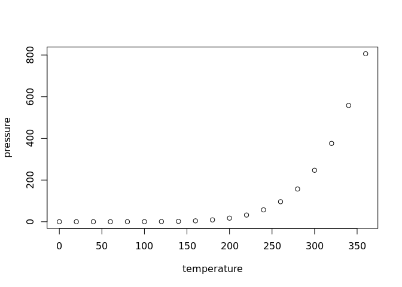

<!-- README.md is generated from README.Rmd. Please edit that file -->

# InSUranceAnaa Lyss

<!-- badges: start -->
<!-- badges: end -->

## RESUMEN

Se obtuvieron datos de las reclamaciones de una aseguradora en
Monterrey. De acuerdo a los datos obtenidos es posible combinar los
riesgos del portafolio de la aseguradora. Este reporte se crea como un
soporte para el Comité de Riesgo para conocer la estructura de los
riesgos así como la influencia de las reclamaciones con las variables
que se conocen.

``` r
DB<-read.csv("/home/alejandro/R/insuranceanalysis2/insurance.csv", sep=",")

summary(DB)
#>    Kilometres         Zone          Bonus            Make      
#>  Min.   :1.000   Min.   :1.00   Min.   :1.000   Min.   :1.000  
#>  1st Qu.:2.000   1st Qu.:2.00   1st Qu.:2.000   1st Qu.:3.000  
#>  Median :3.000   Median :4.00   Median :4.000   Median :5.000  
#>  Mean   :2.986   Mean   :3.97   Mean   :4.015   Mean   :4.992  
#>  3rd Qu.:4.000   3rd Qu.:6.00   3rd Qu.:6.000   3rd Qu.:7.000  
#>  Max.   :5.000   Max.   :7.00   Max.   :7.000   Max.   :9.000  
#>     Insured              Claims           Payment        
#>  Min.   :     0.01   Min.   :   0.00   Min.   :       0  
#>  1st Qu.:    21.61   1st Qu.:   1.00   1st Qu.:    2989  
#>  Median :    81.53   Median :   5.00   Median :   27404  
#>  Mean   :  1092.20   Mean   :  51.87   Mean   :  257008  
#>  3rd Qu.:   389.78   3rd Qu.:  21.00   3rd Qu.:  111954  
#>  Max.   :127687.27   Max.   :3338.00   Max.   :18245026
```

You’ll still need to render `README.Rmd` regularly, to keep `README.md`
up-to-date. `devtools::build_readme()` is handy for this. You could also
use GitHub Actions to re-render `README.Rmd` every time you push. An
example workflow can be found here:
<https://github.com/r-lib/actions/tree/v1/examples>.

You can also embed plots, for example:

<!-- -->

In that case, don’t forget to commit and push the resulting figure
files, so they display on GitHub.
